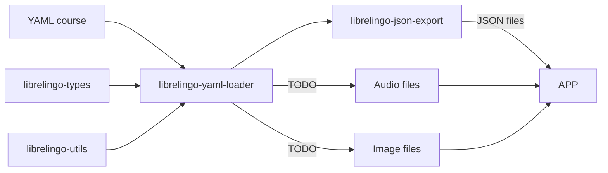

# Development

## Project structure

This project has 2 main components

- Frontend, implemented using Svelte and TypeScript.
- A set of Python packages that provide tooling for course creation and management.

The site is statically built and hosted on GitHub pages, therefore there's no real "backend" or API.

### Clickable flow chart



## Why does this project exist?

This project exists to create a beginner-friendly, community-oriented,
free software licensed language learning application. If you want to learn more
about LibreLingo's background, [I recommend reading this article](https://dev.to/kantord/why-i-built-librelingo-280o).

## Developer guide

The current code development workflow is documented in [Development Guide](development.md).


### Web app

Source code can be found under /apps/web

#### Having the correct version of Node

You will need [Node](https://nodejs.org/en/).

In order to make sure you have the correct `node` version, it's recommended to use
`nvm`. To install `nvm`, please [consult nvm's official documentation](https://github.com/nvm-sh/nvm#installing-and-updating), but if you already have the correct version, you might not strictly need it.

First, install the correct `node` version with this command:

```bash
nvm install 20
```

Then, to choose this version of `node` in your terminal, use

```bash
nvm use 16
```

#### Install dependencies:

For this project it's recommended to use npm exclusively.  
Do not use Yarn; this repository standardizes on npm only.

Once you're in the root folder of the web app, run:

```sh
npm install
```

#### Starting the development server

Start the development server:

```sh
npm run web-serve
```

Now you should be able to see your app on <http://localhost:5173/>

### Python packages

If you want to test export new / updated courses, new features in the YAML format, or some changes in how they are being used
in the frontend, you need to be able to export YAML courses locally.
If you will use docker, everything will be included in the image, otherwise you could choose to install locally the tools needed.

#### Install `pdm`

You will need [PDM](https://pdm-project.org/latest/). If you don't have PDM, you can install it with

```bash
curl -sSL https://pdm-project.org/install-pdm.py | python3 -
```

For more information, check out [PDM's official documentation](https://pdm-project.org/latest/#installation).

#### Install dependencies using PDM

Run

```sh
pdm install
```

This command ensures your local dependencies match the project's **pyproject.toml** and **pdm.lock** files.

##### Handling Outdated Local Dependencies

When you update your local repository by pulling remote changes, your local dependencies might become outdated. To ensure your local dependencies are in sync with the project requirements, follow these brief steps:

###### Updating JavaScript Dependencies

Update your local dependencies:

```bash
npm install
```

This command ensures your local dependencies match the project's **package.json** file.

### Locally test LibreLingo with real courses

In order to test LibreLingo with real courses just like in the deployed production version, you
need to install courses locally and export them from YAML to JSON.

#### Install courses

The following command installs all courses listed in the courses.json file just like
in production. _Keep in mind that in order to use them in the frontend, the courses
also need to be exported!_

```bash
npm run -w apps/web installAllExternalCourses
```

#### Export courses

In order to use a locally installed course when locally testing the frontend, you should
export the course first. You should also export the course every time you make local
changes to this course and you want the changes to be visible in the frontend.

Use the following command:

```bash
npm run exportAllCourses
```

You can export a single course using the following command (change the name of the course for the one that you need to export):

```bash
npm run exportCourse spanish-from-english
```

## Mocks

For mocks in the frontend, LibreLingo uses [MSW](https://mswjs.io/). All of these mocks are defined in apps/web/src/mocks/handlers.js.
